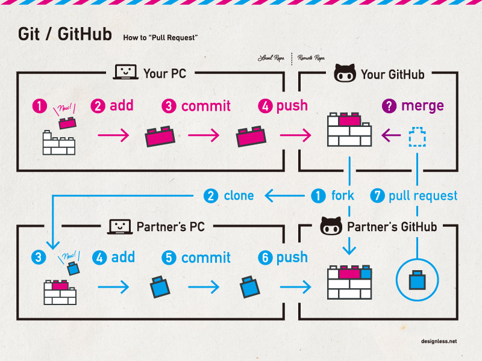
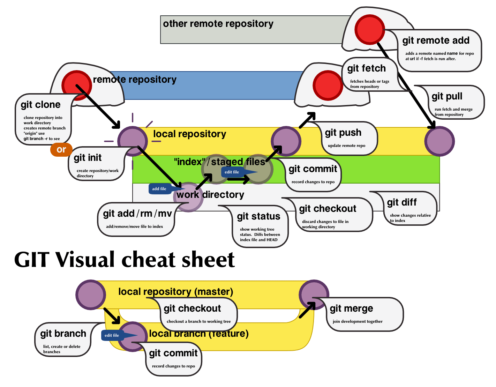

# Содержание: #

- [Содержание:](#содержание)
- [1 . Что такое Git?](#1--что-такое-git)
- [2. Как Git сохраняет изменения](#2-как-git-сохраняет-изменения)
- [3. Структура репозитория](#3-структура-репозитория)
  - [Структура репозитория Git состоит из 4 частей:](#структура-репозитория-git-состоит-из-4-частей)
- [4. Git и GitHab](#4-git-и-githab)
  - [Основные возможности GitHub:](#основные-возможности-github)
- [5. Создание репозитория](#5-создание-репозитория)
- [6. Основные команды](#6-основные-команды)
  - [Большинство операций в Git можно выполнить с помощью основных команд:](#большинство-операций-в-git-можно-выполнить-с-помощью-основных-команд)
    - [Основные действия с репозиторием](#основные-действия-с-репозиторием)
    - [Работа с изменениями](#работа-с-изменениями)
    - [Git Practice:###](#git-practice)
  - [7. Переключение между ветками и ветвление](#7-переключение-между-ветками-и-ветвление)
  - [Git Practice:](#git-practice-1)
- [8. Конфликты](#8-конфликты)
  


# 1 . Что такое Git? #
Разработка приложений и программного обеспечения это долгий процесс. Многие задачи в нем происходят параллельно. Над одним проектом  работает команда разработчиков. И их совместную работу нужно  организовать  так, чтобы разные участники команды могли одновременно работать над программой и не мешать друг другу. 
Представь, что одну большую картину одновременно рисует сразу много художников. Кто-то рисует людей, кто-то деревья или небо. Промежуточные версии картины нужно сохранять,   чтобы понять кто и в какой момент что-то добавил.
Систему контроля версий можно представить в виде альбома. Каждый художник добавляет в него результаты своей работы. Если полистать такой альбом, то можно будет  увидеть, как менялась картина на протяжении творческого процесса. Можно взять старые версии и добавить их в текущую. Можно объединять результаты работы участников команды.

# 2. Как Git сохраняет изменения #

Git — это распределённая система управления версиями, которая позволяет сохранять изменения в коде проекта. Когда вы работаете с Git, каждое изменение в коде сохраняется в отдельном коммите (commit).

У файла может быть всего три состояния:

 * рабочая копия (working tree)

* область индексирования (staging area) каталог

* git (git directory).
  

Когда вы сохраняете изменения в Git, они сохраняются локально на вашем компьютере. Чтобы поделиться изменениями с другими участниками проекта или сохранить их на сервере, вы должны отправить эти изменения на удалённый репозиторий (обычно это GitHub). https://github.com/


# 3. Структура репозитория #

Git репозиторий - это место, где хранятся все файлы вашего проекта, а также история изменений этих файлов.
В репозитории вы можете создавать, редактировать, удалять файлы, а также фиксировать изменения с помощью коммитов. Git репозиторий позволяет вам отслеживать и контролировать все изменения, которые вы вносите в свой проект. Если вы только начинаете проект, можно превратить текущий каталог в Git-репозиторий и начать совместную работу. 

## Структура репозитория Git состоит из 4 частей: ##

 
* Рабочий каталог. Это локальный каталог, в котором создаётся проект и в который вносятся изменения.

* Промежуточная область (или индекс). Это область, куда нужно поместить проект перед фиксацией. Она используется для проверки кода другими членами команды.

* Локальный репозиторий. Это локальный репозиторий, в который вносятся изменения в проект перед отправкой в центральный репозиторий.

* Центральный репозиторий. Это основной проект на центральном сервере, копия которого находится у каждого члена команды в качестве локального репозитория.

Вся структура репозитория является внутренней для Git и прозрачна для разработчика.

У каждого проекта, который работает Git есть свой собственный репозиторий.  Благодаря репозиторию становится возможным работа с версиями проекта, разделением его на отдельные ветки, разделение и слияние разных версий проекта.
Скачать дистрибутив  мможно по ссылке https://git-scm.com/downloads

Есть несколько способов установить Git на компьютер. Самый простой - просто скачать установщик. Все как в случае с любой другой программой. Нет ничего сложного, достаточно скачать нужную версию на сайте документации git. Установщик задаст несколько вопросов. На большую часть можно оставить ответы по умолчанию. Теперь можно использовать git. Проверить что git установлен и готов к работе можно с помощью команды git --version в терминале, если все правильно в результате выполнения команды вы увидите версию гита. 

Внимание! Гит репозиторий делается один раз на проект в корневом файле, который содержит все файлы вашего проекта!

# 4. Git и GitHab #

GitHub — это веб-сервис для хранения кода проектов и совместной работы над ними. Любой пользователь может создать на GitHub аккаунт и разместить в нём свой проект, который будет доступен другим участникам команды или сообщества. Также можно клонировать на свой компьютер чужие проекты, чтобы изучить их код или внести свой вклад в их разработку. 

## Основные возможности GitHub: ##

* Контроль версий кода. С помощью GitHub можно отслеживать изменения в коде проекта и возвращаться к предыдущим версиям при необходимости.

* Совместная работа. Несколько разработчиков могут одновременно работать над одним проектом, внося изменения и комментируя код.

* Управление доступом. Можно настроить доступ к проекту для разных пользователей или групп пользователей.

* Обмен опытом. На GitHub можно найти полезные советы, решения задач и примеры кода от других разработчиков.

* Интеграция с другими сервисами. 

GitHub поддерживает интеграцию с другими популярными сервисами для разработки, такими как [GitHub](github.com), [BitBucket](bitbucket.com), [GitLab](gitlab.com) и другими.
 
 # 5. Создание репозитория #

Основные действия с репозиторием
git init
Команда git init используется для создания нового локального репозитория Git. После выполнения этой команды Git создает в текущей директории новую поддиректорию с именем .git, в которой хранятся все файлы Git, необходимые для управления версиями в этом репозитории.

Синтаксис команды git init:  
   ```
   git init
   ```
 И гит сделает все необходимое за вас. Будет добавлен подкаталог .git с данными о гит-репозитории.

Пример использования команды git init:
```
$ cd my_project
$ git init
Initialized empty Git repository in /path/to/my_project/.git/
```
# 6. Основные команды #

## Большинство операций в Git можно выполнить с помощью основных команд: ##
Все команды в Git можно разделить на несколько групп:

* Создание репозитория (create)
* Просмотр изменений (browse)
* Откат (revert)
* Обновление файлов (update)
* Работа с ветками (branch)
* Внесение изменений (commit)
* Публикация изменений (publish)


### Основные действия с репозиторием ###

   
Команда git clone используется для создания локальной копии удаленного репозитория Git. Это позволяет вам получить копию проекта на вашем локальном компьютере и начать работу с ним.

1. git clone
   
Синтаксис команды git clone:
```
git clone <URL репозитория> [<название локальной папки>]

```
где <URL репозитория> - это URL-адрес удаленного репозитория Git, а <название локальной папки> (необязательный параметр) - это название локальной папки, в которую будет склонирован репозиторий. Если <название локальной папки> не указан, Git автоматически создаст папку с названием репозитория.

Пример использования команды git clone:
```
git clone https://github.com/username/repo.git
```
### Работа с изменениями ###

1. git add .
   
Команда git add . используется для добавления изменений в индекс Git. Индекс - это промежуточный слой между рабочей директорией (где находятся ваши файлы) и репозиторием Git (где сохраняются изменения). Когда вы делаете изменения в файлах в рабочей директории, они не автоматически добавляются в индекс. Для того, чтобы добавить изменения в индекс, необходимо использовать команду git add.

Синтаксис команды git add . :
```
git add .
```
Эта команда добавляет все измененные файлы в рабочей директории в индекс.

Пример использования команды git add . :

Создайте новый файл с названием file.txt в вашей рабочей директории и добавьте в него любой текст.

Выполните команду git status, чтобы увидеть изменения в рабочей директории:
```
$ git status
On branch master
Untracked files:
(use "git add <file>..." to include in what will be committed)
file.txt

nothing added to commit but untracked files present (use "git add" to track)
```
1. git status – показывает состояние ваших файлов: какие файлы были изменены, но еще не добавлены в индекс (staged), и какие файлы уже добавлены в индекс.
```
git status
```
Используйте команду git status, чтобы проверить текущее состояние репозитория.

1. git commit
Сохраняет изменения в коммит
  git commit -m 'commit message' — создает коммит с сообщением
1. git push
Заливает текущие локальные коммиты в удаленный репозиторий
1. git pull
Забирает изменения с удаленного репозитория в локальный
1. git clone
Клонирует проект с удаленного репозитория

 

### Git Practice:###

1. Создайте новый проект (или просто папку для тех, кто пользуется VSCode) с названием "GitPractice"
2. Инициализируйте новый репозиторий Git внутри проекта (убедитесь, что вы не находитесь внутри другого репозитория Git!).
3. Создайте новую папку в проекте с названием: TypesOfTesting
5. Внутри папки создайте 2 файла .txt
6. Запишите в каждый из файлов   несколько слов.
8. Создайте новый коммит, включающий ТОЛЬКО изменения из одного файла .txt. Подумайте, какое сообщение вы напишите.
9. Создайте новый коммит, включающий ТОЛЬКО изменения из второго файла .txt. Подумайте, какое сообщение вы напишите.
10. Добавьте в один из файлов строку - "That's my favourite of favourites test type"
11. Во втором файле поменяйте определение на другое. 
12. Сделайте коммит, который включает изменения В ОБОИХ файлах. 
    
   

## 7. Переключение между ветками и ветвление ##

git branch  - выводит все ваши ветки в данном репозитории
git branch -v  - выводит все ветки, их хэш  и последний коммит на ветке

Git checkout — команда, которая позволяет разработчикам переключаться между ветками, перемещаться по коммитам, восстанавливать файлы из предыдущих состояний и не только.

git checkout branch-name - переключит на ветку branch-name

git checkout -b new-branch - создаст и переключит на новую ветку

Рекомендации для названия веток:
* Без пробелов
* Все буквы маленькие (иногда допускаются заглавные в проектах)
* Разделение между словами можно сделать дефисом 
* Можно использовать цифры (но первой должна быть буква)
  
## Git Practice: ##
Для этого упражнения можете как работать в предыдущем репозитории, так и создать новый.
Я сознательно убрала некоторые промежуточные переключения между ветками и коммиты - будьте внимательны и следите за сообщениями от гита, он сам подскажет если что-то будет неправильно.

1. Создайте новую ветку new-branch и переключитесь на нее.
2. В новой ветке создайте txt файл и запишите туда какие команды вы использовали для создания и переключения ветки
3. Закоммитте изменения
4. Объедините main ветку с new-branch
5. Создайте еще одну ветку another-branch другой командой
6. В новой ветке в txt файл, который был создан в ветке new-branch, запишите те новые команды, которые вы использовали для создания another-branch
7. В основной ветке - main, создайте файл bugfix.txt 
8. Смерджите main и another-branch
   


# 8. Конфликты #

Существует три способа исправить конфликт в Git:

Принять локальную версию. Чтобы принять все изменения в файле из локальной версии, выполните команду: `git checkout --ours <имя файла>`. Чтобы принять локальную версию для всех конфликтующих файлов, используйте: `git merge --strategy-option ours`.

Принять удалённую версию. Чтобы обновить изменения в файле из удалённой ветки, выполните команду: `git checkout --theirs <имя файла>`. Чтобы принять удалённую версию для всех конфликтующих файлов, используйте: `git merge --strategy-option theirs`.

Проанализировать изменения индивидуально. Этот вариант является лучшим, особенно при работе с несколькими файлами и людьми. Чтобы облегчить анализ, можно использовать специальные инструменты.

